# Titanic Veri Seti 

Bu veri seti, Titanic gemisinin yolcularıyla ilgili bilgileri içerir. Her bir yolcunun yaş, cinsiyet, sınıf gibi özellikleri ile hayatta kalıp kalmadığı bilgisi bulunur.

## Veri Seti Bİlgileri 

* Veri seti bir CSV dosyasında yer alır. (dataset/titanic_dataset.csv)
* Veri seti boyutu : (891, 12)

### CSV Dosyasındaki Sütunlar ve Anlamları

* Survived: Yolcunun hayatta kalıp kalmadığını belirten ikili bir değer (0: Hayatta kalmadı, 1: Hayatta kaldı).
* Pclass: Yolcunun seyahat ettiği sınıfı gösteren kategorik bir değer (1, 2 veya 3).
* Sex: Yolcunun cinsiyetini gösteren kategorik bir değer ("male" veya "female").
* Age: Yolcunun yaşı (sayısal değer, eksik değerler içerebilir).
* Sibsp: Yolcunun gemideki eşi veya kardeş sayısı (sayısal değer).
* Parch: Yolcunun gemideki ebeveyn veya çocuk sayısı (sayısal değer).
* Ticket: Bilet numarası veya kimlik (string değer).
* Fare: Yolcunun ödediği ücret (sayısal değer).
* Cabin: Yolcunun kabin numarası (string değer, eksik değerler içerebilir).
* Embarked: Yolcunun gemiye hangi limandan bindiğini belirten kategorik bir değer (C: Cherbourg, Q: Queenstown, S: Southampton).

# PROJE 

Bu veri seti, hayatta kalma tahminlerinin sınıflandırma problemlerini çözmek için kullanılacaktır. Bu işlem için belirli aşamalar olacaktır.

## PROJE AŞAMALARI

## 1) **Kütüphaneler**

- **numpy**: Sayısal hesaplamalar için kullanılır, özellikle çok boyutlu diziler ve matris işlemleri için kullanılır.
- **pandas**: Veri manipülasyonu ve veri analizi için kullanılır, tablo veri yapılarını destekler ve veri setlerini kolayca işlemek için kullanılır. 
- **re**: Python'da düzenli ifadelerle (regular expressions) metin işleme yapmak için kullanılır, metinlerde desenleri bulmak, değiştirmek veya ayıklamak için kullanılır.
- **seaborn**: Veri görselleştirmesi için kullanılır, matplotlib'e dayanır ancak daha estetik ve kullanıcı dostu grafikler oluşturmayı sağlar.
- **matplotlib**: Grafik oluşturmak için kullanılır, çizgi grafikleri, dağılım grafikleri, histogramlar, görselleştirmeler ve diğer türde grafikler oluşturmak için kullanılır.
- Makine öğrenimi için ilgili kütüphaneler.

## 2) **Veri Setinin Okunması**
* CSV dosyasından veri seti okunarak bir DataFrame'e atanır.

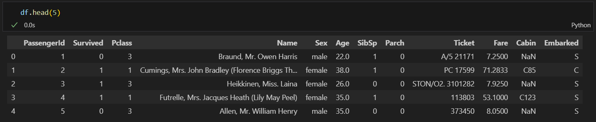 

### 3) **Veri Seti İçin Keşifsel Veri Analizi (EDA - Exploratory Data Analysis) VE VERİ ÖN İŞLEME**

EDA görsel veya nümerik yöntemlerle, veriyi bir özet üzerinden yorumlama yaklaşımıdır. Veriyi ön işleme noktasında atılması gereken adımlardan çıkarım yapmak için kullanılacak metod ve modele kadar pek çok konuda fikir sahibi olunmasını sağlar.

* Veri seti içerisndeki sütun değişkenlerinin veri tipleri:

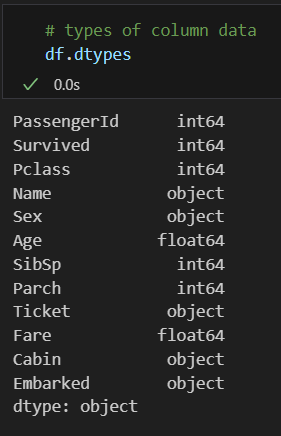

* Veriye dair özet bilgi. (count: veri sayısı , mean: ortalaması, std: standart sapması, min: minimum değeri, max: maksimum değeri)

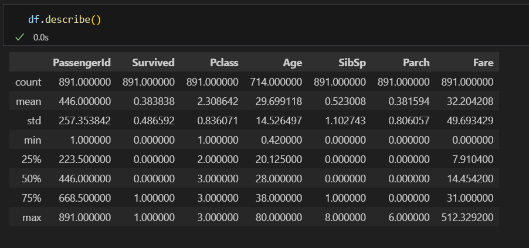

* Veride eksik değer içeren sütun kontrolü. ("Sex", "Cabin" ve "Embarked" sütunlarında eksik değerler var.)

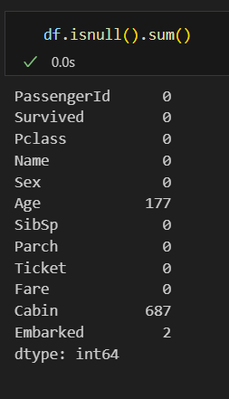

<!--
* Eksik değerlerin görselleştirilmesi.

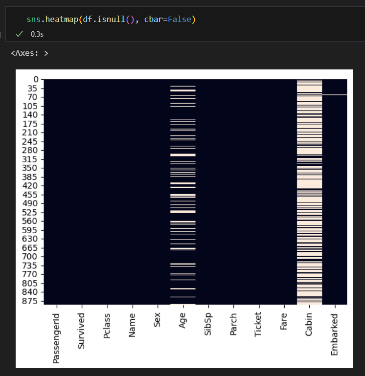
-->

**Eksik Değerlerin Doldurulması**

    "Age" sütunu için: Sütunndaki bütün verilerin ortalaması ile doldurulur. 
    
    "Cabin" sütunu için: Sütunda en çok tekrar eden değer ile doldurulur.
    
    "Embarked" sütunu için: Sütunda en çok tekrar eden değer ile doldurulur.

**One-Hot Encoding**

Katkı sağlayacağı düşünülen kategorik verileri sayısal verilere dönüştürerek, makine öğrenimi modellerinin bu verileri daha etkin bir şekilde işlemesini sağlar. 

'Sex' sütunundaki 'female' ve 'male' değerlerini 0 ve 1'e dönüştürülür.

    df['Sex'] = df['Sex'].replace({'female': 0, 'male': 1})

**Korelasyon Matrisi**

Bir veri setindeki sayısal değişkenler arasındaki ilişkileri gösteren bir matristir. 

* 1'e yaklaşan bir korelasyon katsayısı, pozitif bir ilişkiyi gösterir. Yani, bir değişkenin değeri arttığında diğer değişkenin de artma eğiliminde olduğunu ifade eder.

* -1'e yaklaşan bir korelasyon katsayısı, negatif bir ilişkiyi gösterir. Yani, bir değişkenin değeri arttığında diğer değişkenin azalma eğiliminde olduğunu ifade eder.

* 0'a yaklaşan bir korelasyon katsayısı, değişkenler arasında bir ilişki olmadığını veya çok zayıf bir ilişki olduğunu gösterir.

**Temizlenmiş Verinin Kaydedilmesi**

Temizlenmiş veri bir CSV dosyasına kaydedilir, daha sonra veri temizleme işlemleri tekrar yapmamak için. 
(dataset/clean_data_titanic.csv)

## 3) **Veri Setinin Görselleştirilmesi**

Veri setindeki sütun değerleri kullanılarak grafikler oluşturulur. Elde edilen çıktılar ipynb dosyasında yer almaktadır.

<!--
* "Age" sütununa göre, "Survived" yani hayatta kalıp kalmadıklarını gösteren grafik:

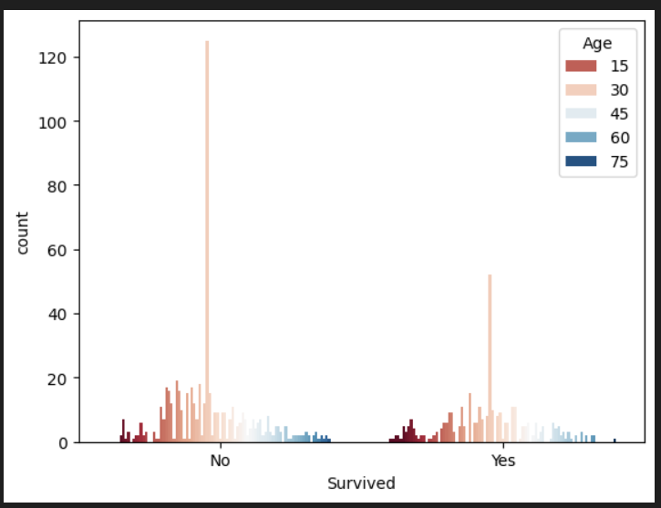

* "Fare" sütununa göre, "Survived" yani hayatta kalıp kalmadıklarını gösteren grafik:

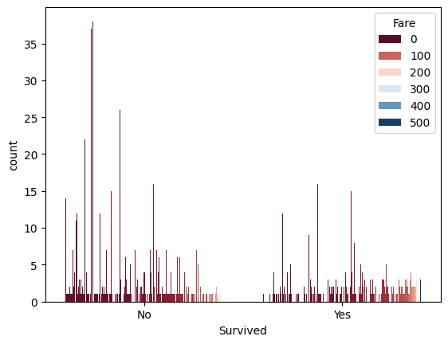      

* 'Embarked' sütunundaki benzersiz değerlerin histogram grafiği: 

* "Pclass" sütununa göre, "Survived" yani hayatta kalıp kalmadıklarını gösteren grafik

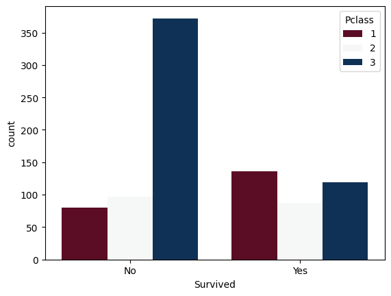

-->

## 4) **Modelleme**

### **Temizlenmiş Veri Üzerinde İşlemeler**

String ifade içeren sütunlar ve model için gereksiz olduğunu düşünülen sütunlar çıkarılır.
    
    data = df.drop(['PassengerId', 'Name', 'Cabin', 'Ticket', 'Embarked'], axis=1)

Bağımlı değişkenin yani etiket olarak belirlenen değişkenin (Survived), diğer değişkenler arasındaki korelasyonuna bakılır. 

    data.corr()["Survived"] 

"Survived" ile korelasyon değeri 0.1 ve -0.1 aralığında olan sütun (Parch) da veri setinden temizlenir.

    data = data.drop(['Parch'],axis=1)

Datada ögrenecek sütunları("Survived") ve sonuç sütunları ayrılır.
    
    y=data["Survived"].values  # bağımsız değişkenler
    X=data.drop("Survived",axis=1).values # bağımlı değişken

Veri eğitim ve test seti olarak bölünür.

    X_train, X_test, y_train, y_test = train_test_split(X, y, test_size=0.3, random_state=42)

*sklearn* kütphanesi kullanılmıştır.

### **Sınıflandırma İçin Kullanılan Modeller:**

- ***Random Forest Sınıflandırma:*** Birden çok karar ağacının bir araya gelerek oluşturduğu bir ansambil yöntemidir. Her ağaç aynı veri seti üzerinde ayrı ayrı eğitilir ve ardından sonuçlar birleştirilir.

    *RandomForestClassifier sınıfı kullanılmıştır.*

- ***LGBM Sınıflandırma:*** Hafif, hızlı ve yüksek performanslı bir Gradient Boosting framework'üdür. Büyük veri setlerinde bile etkili sonuçlar elde eder. 

    *LGBMClassifier sınıfı kullanılmıştır.*

- ***Karar Ağacı Sınıflandırma:*** Veri setindeki özellikleri kullanarak bir karar ağacı oluşturur. Veri setini sürekli olarak özniteliklerine göre böler ve sonunda bir sınıflandırma yapar.

    *DecisionTreeClassifier sınıfı kullanılmıştır.*

- ***Destek Vektor Makinesi (SVM) Sınıflandırma = SVC:*** Bir sınıflandırma algoritmasıdır ve veri noktalarını farklı sınıflara ayıran bir veya daha fazla hiper düzlem oluşturarak çalışır. Ayırt edici nitelikteki veri noktaları olan destek vektörlerini kullanarak optimal hiper düzlemi bulur.

    *SVC sınıfı kullanılmıştır.*

### **Modellerin Başarısını Ölçmek İçin Kullanılan Metrikler:**

- ***F1 Score:*** Bir sınıflandırma modelinin performansını değerlendirmek için kullanılan bir ölçümdür. Bu ölçüm, modelin doğruluk (precision) ve duyarlılık (recall) metriklerinin harmonik ortalaması ile elde edilir.

- ***Accuracy Score:*** Bir sınıflandırma modelinin doğruluk oranını gösterir ve modelin doğru sınıflandırma oranını yüzde cinsinden belirtir.

- ***5 Kat Çapraz Doğrulama Doğruluk Skoru:*** Modelin genelleme performansını değerlendirmek için kullanılan bir yöntemdir; veri kümesini 5 parçaya böler ve her bir parçayı sırayla test seti olarak kullanarak modelin doğruluğunu değerlendirir.
- ***Confusion Matrix (Karışıklık Matrisleri):*** Bir sınıflandırma modelinin performansını değerlendirmek için kullanılan bir matristir ve modelin doğru ve yanlış sınıflandırma sonuçlarını gösterir.

    Örnek confusion matrix:

    [[144  13]
     [ 41  70]]

    * True Negative (TN): Gerçekte negatif olan ve negatif olarak tahmin edilen örnek sayısı. Bu durumda, 144.
    * False Positive (FP): Gerçekte negatif olan ancak pozitif olarak tahmin edilen örnek sayısı. Bu durumda, 13.
    * False Negative (FN): Gerçekte pozitif olan ancak negatif olarak tahmin edilen örnek sayısı. Bu durumda, 41.
    * True Positive (TP): Gerçekte pozitif olan ve pozitif olarak tahmin edilen örnek sayısı. Bu durumda, 70.

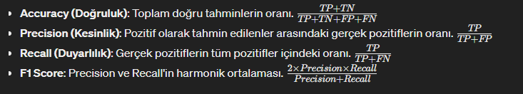 

### **Ayrıca modellerin hiperparametre optimizasyonu için *RandomizedSearchCV* kullanılmıştır.**

***"RandomizedSearchCV"***, belirli bir aralık içinde rastgele hiperparametre değerleri seçerek en iyi model parametrelerini bulmayı amaçlayan bir çapraz doğrulama yöntemidir. Bu yöntem, parametre arama alanını genişletmeden ve hesaplama maliyetini azaltarak etkili sonuçlar elde etmeye yardımcı olur.

- ***best_score_:*** RandomizedSearchCV tarafından bulunan en iyi kestiricinin ortalama çapraz doğrulama doğruluk skorunu ifade eder. Bu, modelin eğitim verisi kullanılarak çapraz doğrulama sürecinde görünmeyen veriler üzerinde ulaştığı ortalama doğruluk skorudur.

## MODELLEME SONUCUNDA ELDE EDİLEN SONUÇLAR 

**Hiper Parametre Optimizasyonu Olmadan Elde Edilen Sonuçlar:**

| Model                         |F1 Score          | Accuracy Score   | 5 Kat Çapraz Doğrulama Doğruluk Skoru   
|-------------------------------|------------------|------------------|----------------------------------------
| Random Forest Sınıflandırma   | 0.7632           | 0.8171           | 0.8171                                 
| LGBM Sınıflandırma            | 0.7632           | 0.8171           | 0.8182                                 
| Karar Ağacı Sınıflandırma     | 0.6915           | 0.7537           | 0.7744                                 
| Support Vector Machine (SVC)  | 0.3892           | 0.6604           | 0.6746                                 

 

**Hiper Parametre Optimizasyonu ile Elde Edilen Sonuçlar:**

| HPO'lıu Model                 | F1 Score       |best_score_      | Accuracy Score   | 5 Kat Çapraz Doğrulama DoğrulukSkoru   
|-------------------------------|----------------|-----------------|------------------|----------------------------------------
| Random Forest Sınıflandırma   | 0.7434         | 0.8282          | 0.8171           | 0.8373                                  
| LGBM Sınıflandırma            | 0.76           | 0.8443          | 0.8208           | 0.8271                                  
| Karar Ağacı Sınıflandırma     | 0.7536         | 0.8121          | 0.8097           | 0.8114                                    
| Support Vector Machine (SVC)  | 0.7358         | 0.7849          | 0.7910           | Çalışması yaklaşık 5 saat sürmesine rağmen tamamlanamadı. 

 

**Confusion Matrix**

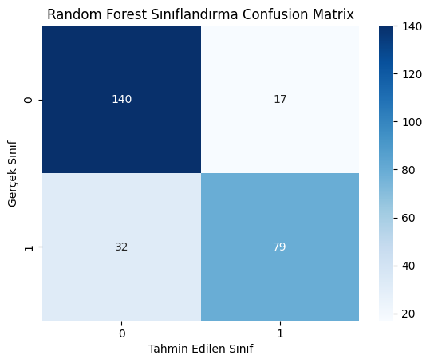
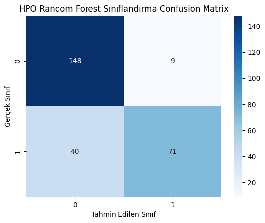
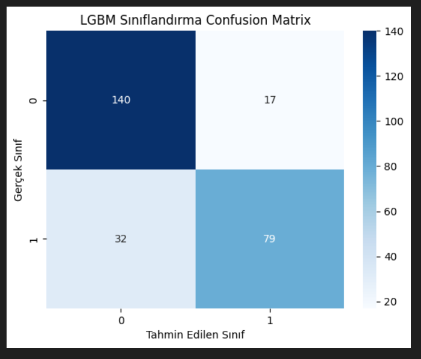

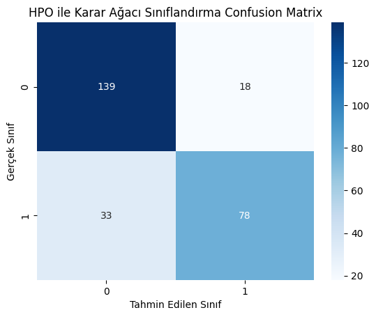
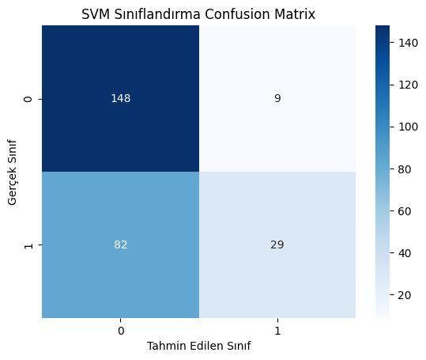
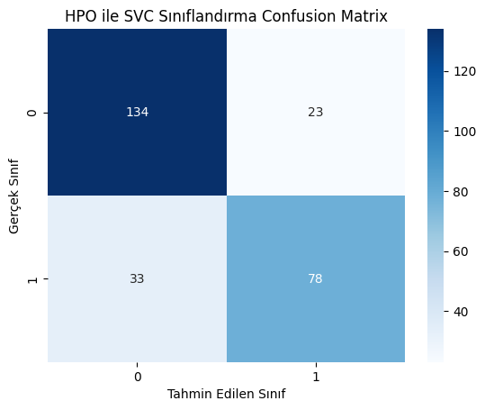

# SONUÇ

* Bütün modellerin doğruluk metriklerine bakılarak karşılaştırılmalarında HPO uygulanmış LGBM Sınıflandırmanın en iyi sonuç verdiği görülmektedir.

* Confusion matrisleri karşılaştırıldığında ise yine HPO uygulanmış LGBM Sınıflandırmanın daha iyi bir model olduğunu gösterir.

**Doğruluğun arttırılması için yapılabilecekler:**

- Daha karmaşık bir model algoritması seçilebilir.
- Veri setinin boyutu arttırılarak modelin daha iyi öğrenmesi sağlanabilir.
